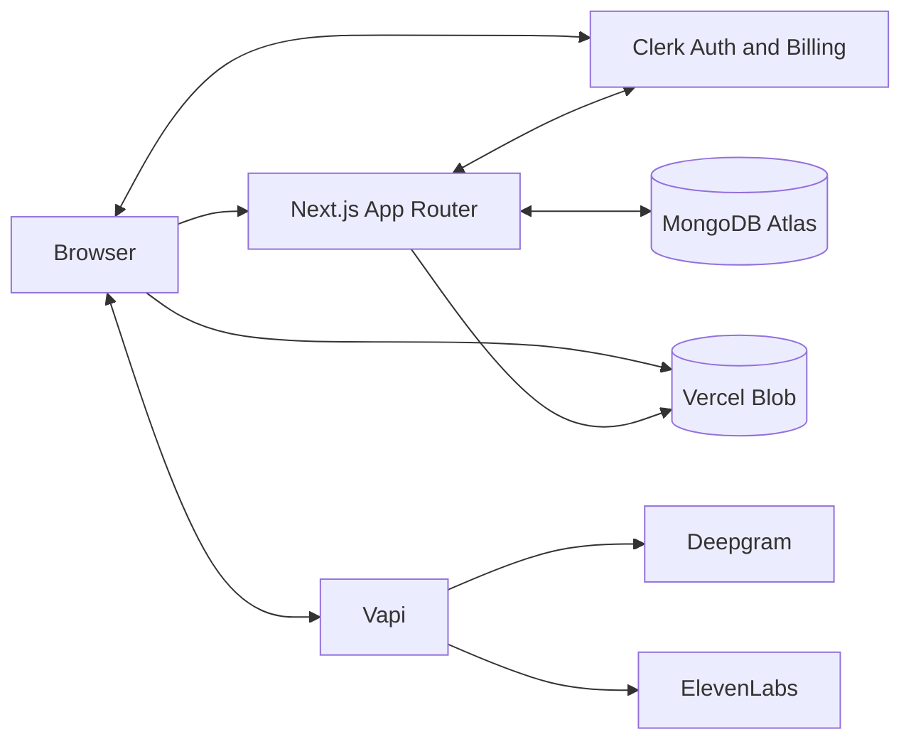
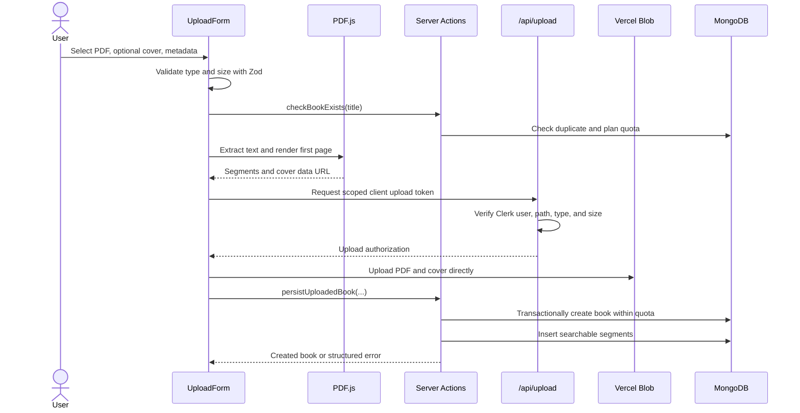
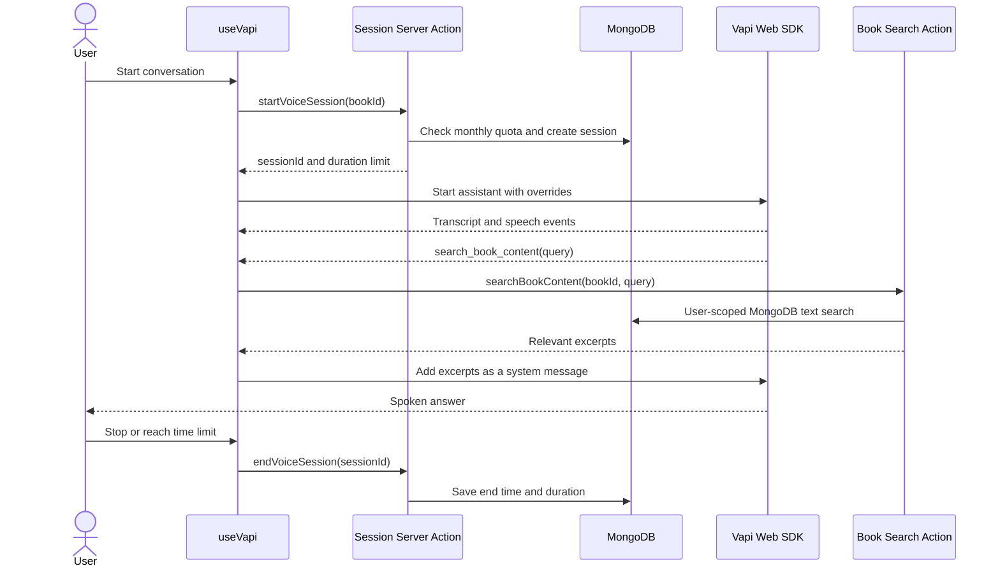

# Architecture

## Overview

Bookified is a Next.js App Router application with a server-rendered library
and focused Client Components for uploads, navigation, and voice interaction.
Clerk provides identity and billing state, MongoDB stores user-scoped book data,
Vercel Blob stores public source files, and Vapi manages real-time voice calls.



## App Router Structure

| Route | File | Rendering and access |
| --- | --- | --- |
| `/` | `app/(root)/page.tsx` | Dynamic Server Component; protected |
| `/books/new` | `app/(root)/books/new/page.tsx` | Server Component; protected |
| `/books/[slug]` | `app/(root)/books/[slug]/page.tsx` | Dynamic book page; protected |
| `/subscriptions` | `app/(root)/subscriptions/page.tsx` | Clerk pricing; protected |
| `/sign-in/*` | `app/sign-in/[[...sign-in]]/page.tsx` | Public Clerk route |
| `/sign-up/*` | `app/sign-up/[[...sign-up]]/page.tsx` | Public Clerk route |
| `/api/upload` | `app/api/upload/route.ts` | Protected Blob token handler |
| `/api/voice/synthesize` | `app/api/voice/synthesize/route.ts` | Protected synthesis handler |
| `/api/vapi/search-book` | `app/api/vapi/search-book/route.ts` | Public webhook with secret auth |

The `(root)` route group organizes application pages without adding a URL
segment. Next.js 16 uses `proxy.ts` rather than the older `middleware.ts`
convention.

## Server and Client Components

Pages and layouts are Server Components by default.

### Server Components

- `app/layout.tsx`
- Library, upload, book, and subscriptions pages
- `RecentBooksSection`
- `HeroSection`
- `BookCard`

These components fetch user-scoped data, resolve subscriptions, generate
metadata, and keep database access out of the browser.

### Client Components

- `Navbar`
- `BookSearch`
- `UploadForm`
- `VapiControls`
- `Transcript`
- `SubscriptionLimitToast`
- shadcn form primitives

Client Components own React state, form events, browser file APIs, microphone
access, Vapi SDK events, and navigation updates.

The `client-only` and `server-only` imports enforce module boundaries for the
upload workflow, Vapi code, subscription helpers, persistence services, and
Blob cleanup.

## Server Actions

`lib/actions/book.actions.ts` and `lib/actions/session.action.ts` are
`"use server"` modules. They:

- Re-check Clerk authentication for every action
- Resolve subscription limits on the server
- Call `server-only` persistence services
- Return serializable result objects
- Scope book queries and writes by Clerk user ID
- Revalidate the library after successful persistence

Server Actions are callable network entry points. Proxy protection and page
redirects are convenience layers, not replacements for action-level
authorization.

## Database Layer

`database/mongodb.ts` maintains a development-safe global Mongoose connection
cache and a maximum pool size of 10. SRV DNS failures can be retried with
fallback DNS servers.

### Collections

| Model | Purpose | Important indexes |
| --- | --- | --- |
| `Book` | Metadata and Blob URLs | User/date; unique user/slug |
| `BookSegment` | Searchable PDF text | Unique book/index; book/page; text search |
| `VoiceSession` | Session start, end, duration, billing period | User/billing period |
| `BookQuotaLock` | Serializes per-user quota checks | `_id` is Clerk user ID |

Book creation uses a MongoDB transaction. A per-user quota lock is incremented
inside the transaction before checking duplicate titles and plan limits. Text
segments are inserted after the book transaction; failures trigger database and
Blob rollback.

## Upload Pipeline

PDF parsing and the initial cover rendering happen in the browser. The files
then upload directly to Vercel Blob with short-lived authorization generated by
the application.



If a client or persistence stage fails after upload, the workflow attempts to
delete every uploaded pathname. Cleanup is idempotent and reports partial
failure.

## PDF Parsing Pipeline

1. Validate a PDF with a maximum size of 50 MB.
2. Dynamically import `pdfjs-dist` in the browser.
3. Configure the PDF.js worker.
4. Render page 1 at scale 2 into a canvas.
5. Convert the canvas to a PNG data URL when no manual cover is provided.
6. Extract text items from every page and join them in page order.
7. Split words into 500-word segments with a 50-word overlap.
8. Persist segment content, index, and word count.
9. Create a MongoDB text index for lexical search.

The current parser does not perform OCR and does not assign page numbers to
segments.

## Vapi Voice Assistant Flow



The hook tracks partial and final transcripts in browser state. Transcript
content is not persisted by the current session actions.

### Vapi Tool Paths

There are two distinct retrieval paths:

1. `search_book_content` is appended at browser call start. The browser handles
   the tool call and invokes the authenticated `searchBookContent` Server
   Action.
2. `search_book` is accepted by `/api/vapi/search-book`. This route is intended
   for a Vapi server webhook, authenticates with `VAPI_WEBHOOK_SECRET`, and
   derives book ownership from `voiceSessionId`.

These tool names and payloads are not interchangeable.

## Authentication Flow

```mermaid
flowchart TD
    Request[Incoming request] --> Proxy[Clerk proxy.ts]
    Proxy --> Public{Public matcher?}
    Public -->|Sign-in, sign-up| Continue[Continue]
    Public -->|Vapi webhook| Webhook[Verify shared secret in route]
    Public -->|No| Clerk[auth.protect()]
    Clerk --> Continue
    Continue --> Entry[Page, Route Handler, or Server Action]
    Entry --> Verify[Re-check auth and ownership near data]
    Verify --> Data[(User-scoped data operation)]
```

The proxy treats sign-in, sign-up, and the Vapi search webhook as public. Every
other matched application or API request is protected. Sensitive Server Actions
still call Clerk auth directly, and database filters include `clerkId`.

## Subscription Flow

`getServerSubscription()` first checks Clerk session plan authorization. If the
session appears Free, it queries Clerk Billing and accepts active items or
canceled items that have not reached their period end.

Limits control:

- Maximum stored books
- Monthly session count
- Maximum duration per voice call
- Whether a plan is eligible for future session-history behavior

Book limits are enforced before the upload and again transactionally during
persistence. Session count is enforced before creating a `VoiceSession`.

## Error Handling

- Server Actions use `ActionResult<T>` with `success`, `data`, and `error`.
- Route Handlers return JSON `{ "error": "message" }` for failures.
- Upload errors include stable codes for UI behavior and cleanup reporting.
- Database and provider errors are logged with reduced, serializable details.
- Client UI uses Sonner to display failures and subscription-limit notices.

See [`API.md`](API.md) for contracts and
[`TROUBLESHOOTING.md`](TROUBLESHOOTING.md) for operational symptoms.
